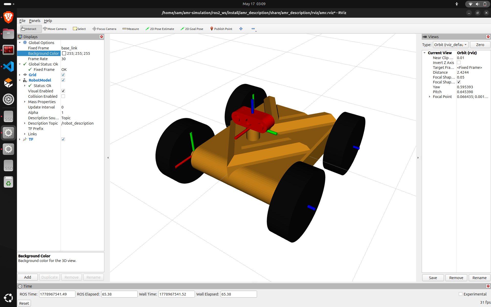

# 🚀 ROS2 AMR Simulation

This project focuses on building and simulating a simple **Autonomous Mobile Robot (AMR)** using ROS2 and Gazebo.

The simulation environment is designed for understanding the core concepts of mobile robotics, robot control, sensor integration, and robot visualization in a realistic simulation setup.

---

# 🤖 AMR Robot

<ul>
<li>A simple Differential Drive Autonomous Mobile Robot (AMR).</li>
<li>Built for ROS2 and Gazebo simulation.</li>
<li>Modular and easy to expand for advanced robotics applications.</li>
</ul>



---

# 🌍 Simulation Environments

## 🟢 Basic Simulation World

A minimal environment for testing robot motion and control.

### Features
- Differential drive motion
- Keyboard teleoperation
- ROS2 `/cmd_vel` control
- Gazebo simulation support

### Purpose
- Robot movement testing
- Velocity control validation
- Simulation environment setup


---

## 🟡 Obstacle Environment

A world containing obstacles for testing robot interaction and movement behavior.

### Features
- Static obstacles
- Narrow passages
- Turning and maneuvering tests

### Purpose
- Obstacle interaction
- Motion behavior analysis
- Navigation testing


---

## 🔵 Sensor Environment

A structured environment for testing robot sensors and visualization.

### Features
- Lidar integration
- RViz visualization
- `ros2 bag` recording and playback
- Sensor data streaming

### Purpose
- Sensor simulation
- Data visualization
- Perception system testing


---

# 🎯 Project Goals

- Develop a simple AMR simulation platform
- Explore ROS2 and Gazebo integration
- Simulate robot movement and sensing
- Provide a foundation for autonomous robotics development
- Support future navigation and perception systems

---

# ⚙️ Requirements

- ROS2 Jazzy (or compatible)
- Gazebo Sim
- Python
- RViz2

---

# ▶️ Running the Simulation

```bash
# Build workspace
colcon build

# Source workspace
source install/setup.bash

# Launch simulation
ros2 launch amr_sim clean_world.launch.py

# Control robot
ros2 run teleop_twist_keyboard teleop_twist_keyboard
