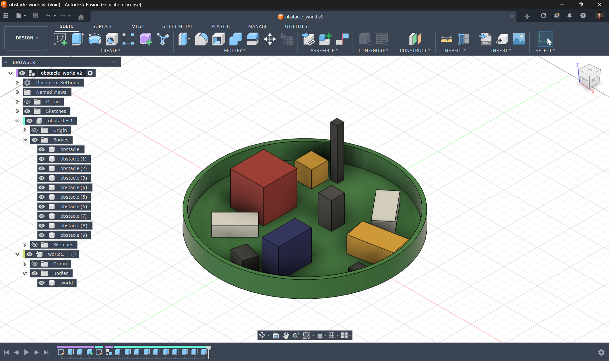
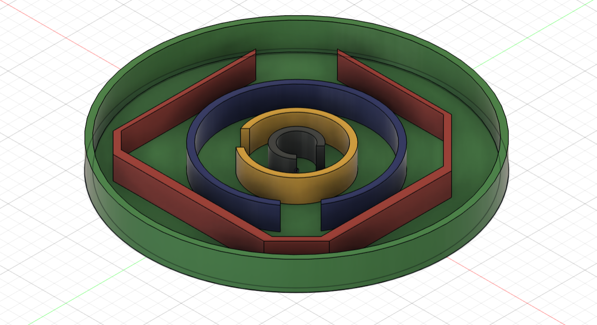

# ROS2 Gazebo Tutorial Series:

This repository contains simulation environments and a simple mobile robot designed to help beginners transition from turtlesim to Gazebo.
Also the steps for creating a simulation.

## Contents:
- Clean World: Basic robot movement
- Obstacle World: Interaction with environment
- Sensor World: Lidar and rosbag usage

## Requirements:
- ROS2 Jazzy
- Gazebo Sim

## Robot

## Worlds
### Clean World

### Obstacle World

### Sensor World

