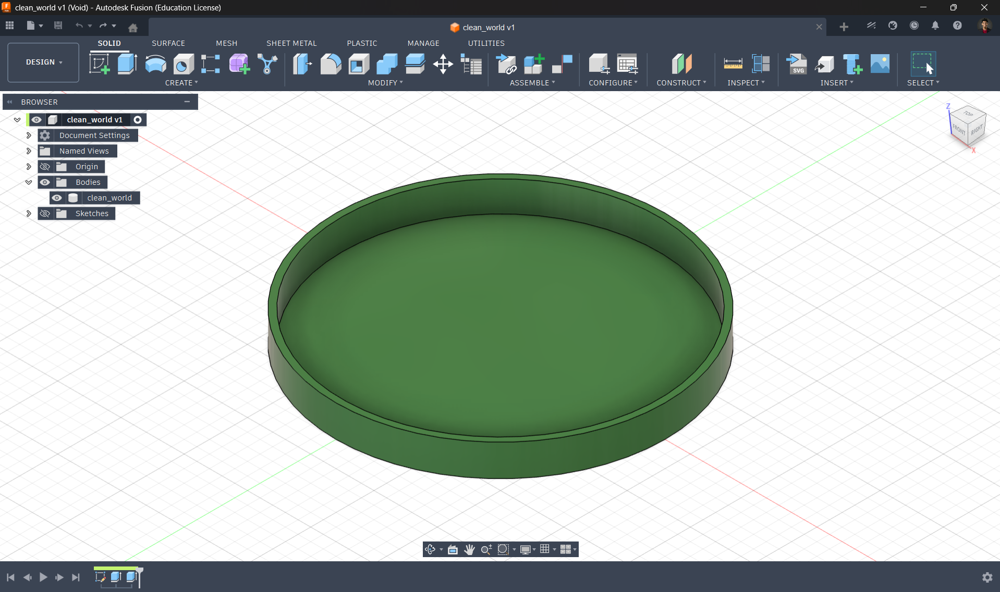
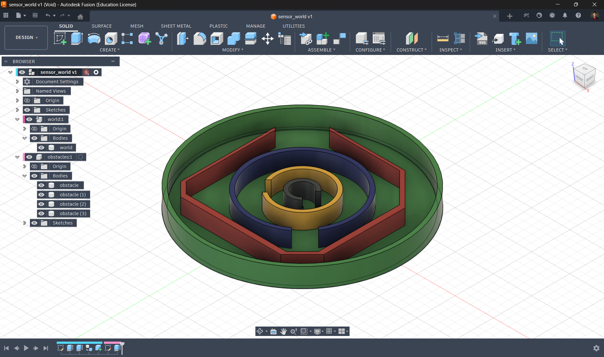
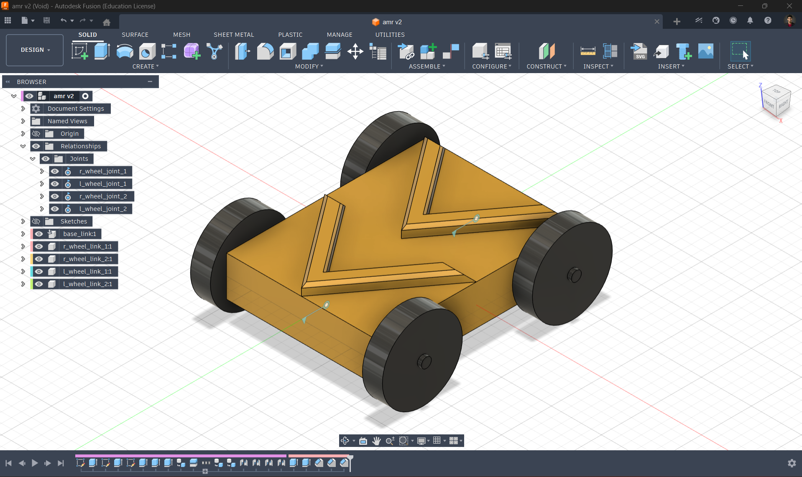

# 🚀 ROS2 Gazebo Simulation Tutorial Series

This project is my attempt to make ROS2 simulation easier to understand for beginners.

While learning with turtlesim, I realized that moving to a full simulation environment like Gazebo can feel overwhelming. There isn’t a clear transition step, and that makes it harder to build confidence.

So, I created this project to provide a smoother, step-by-step learning path.

---

## 🧠 Learning Idea

Instead of jumping directly into complex simulations, this project follows a gradual progression:

turtlesim → basic motion → simulation → obstacles → sensors → visualization

Each stage introduces one new concept, making it easier to understand how real robot systems work.

---

## 🌍 Simulation Worlds

### 🟢 Clean World  
A simple environment to understand robot movement using `/cmd_vel`.

- Focus on basic motion  
- No distractions  
- Helps connect turtlesim concepts to simulation  



---

### 🟡 Obstacle World  
Adds obstacles to introduce interaction with the environment.

- Encourages turning and adjustments  
- Demonstrates basic navigation behavior  
- Introduces simple real-world constraints  


---

### 🔵 Sensor World  
A structured environment designed for working with sensors.

- Includes Lidar setup  
- Supports `ros2 bag` recording and playback  
- Helps visualize sensor data in RViz 

 

---

## 🎯 Goals of This Project

- Make ROS2 simulation more approachable  
- Help beginners move beyond turtlesim  
- Introduce real simulation concepts step-by-step  
- Build a foundation for advanced robotics learning  

---

## ⚙️ Requirements

- ROS2 (Jazzy or compatible)  
- Gazebo Sim  
- Python  

---

## ▶️ How to Run

```bash
# Build workspace
colcon build
source install/setup.bash

# Launch simulation
ros2 launch <your_package> clean_world.launch.py

# Control robot
ros2 run teleop_twist_keyboard teleop_twist_keyboard
'''

---

## Robot
<ul>
<li>A simple Mobile Robot.</li>
<li>Easier for understanding.</li>
</ul>

